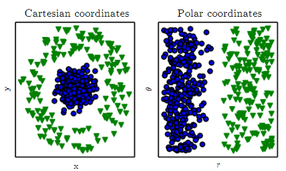
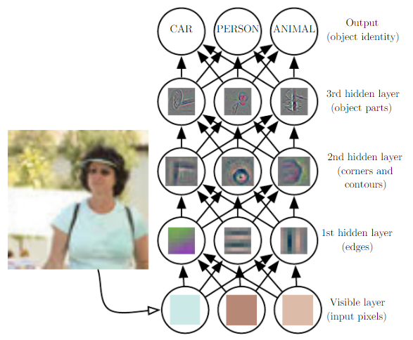
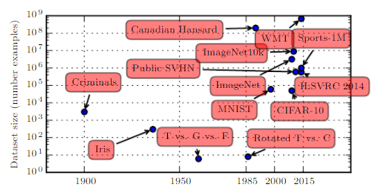
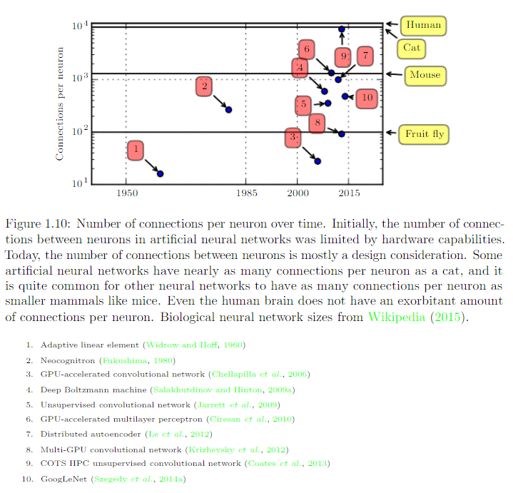
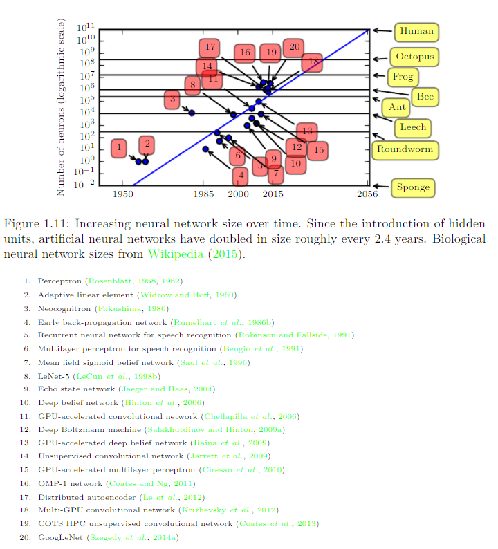

These are my notes for the introductory chapter of the deep learning book. My initial intent was to bundle my notes for the first three chapters since they are all fairly "basic", but I ended up realizing that there was actually a fair amount of material just in the introduction, and I figured it didn't hurt to start with something simple, so I'll do the notes chapter by chapter.

## 1 Introduction

AI was initially based on finding solutions to reasoning problems (symbolic AI), which are usually difficult for humans. However, it quickly turned out that problems that seem easy for humans (such as vision) are actually much harder.

You need a lot of knowledge about the world to solve these problems, but attempts to hard code such knowledge has consistently failed so far. Instead, machine learning usually does better because it can figure out the useful knowledge for itself.

### Representations

Good **representations** are important: if your representation of the data is appropriate for the problem, it can become easy.

For example, see the figure below: in Cartesian coordinates, the problem isn't linearly separable, but in polar coordinates it is. The *polar representation* is more useful for this problem.

Unfortunately, good representations are hard to create: eg if we are building a car detector, it would be good to have a representation for a wheel, but wheels themselves can be hard to detect, due to perspective distortions, shadows etc.!

The solution is to *learn the representations* as well. This is one of the great benefits of deep learning, and in fact historically some of the representations learned by deep learning algorithms in minutes have permitted better algorithms than those that researchers had spent years to fine-tune!

Good representations are related to the *factors of variation*: these are underlying facts about the world that account for the observed data. For instance, factors of variation to explain a sample of speech could include the age, sex and accent of the speaker, as well as what words they are saying. 

Unfortunately, there are *a lot* of factors of variation for any small piece of data. How do you disentangle them? How do you figure out what they are in the first place?

The deep learning solution is to express representations in terms of simpler representations: eg a face is made up of contours and corners, which themselves are made up of edges etc.. It's representations all the way down! (well, not really).

Below is an example of the increasingly complex representations discovered by a convolutional neural network.

There is another way of thinking about deep network than as a sequence of increasingly complex representations: instead, we can simply think of it as a form of computation: each layer does some computation and stores its output in memory for the next layer to use. In this interpretation, the outputs of each layer don't need to be factors of variation, instead they can be anything computationally useful for getting the final result.

#### Meaning of "deep"

How deep a network is depends on your definition of depth. There is no universal definition of depth although in practice many people count "layers" as defined by a matrix multiplication followed by an activation function and maybe some normalization etc.. You could also count elementary operations in which case the matrix multiplication, activation, normalization etc. would all add to the depth individually etc.. Some networks such as ResNet (not mentioned in the book) even have a notion of "block" (a ResNet block is made up of two layers), and you could count those instead as well.

The book also mentioned that yet another definition of depth is the depth of the graph by which concepts are related to each other. In this case, you could move back from complex representations to simpler representations, thus implicitly increasing the depth. Their example is that you can infer a face from, say, a left eye, and from the face infer the existence of the right eye. To be honest I don't fully understand this definition at this point. According to the book it is related to deep probabilistic models.

### History

Deep learning is not a new technology: it has just gone through many cycles of rebranding!

It was called "cybernetics" from the 40s to the 60s, "connectionism" from the 80s to the 90s and now deep learning from 2006 to the present. The networks themselves have been called perceptrons, ADALINE (perceptron was for classification and ADALINE for regression), multilayer perceptron (MLP) and artificial neural networks. The most common names nowadays are neural networks and MLPs.

A quick history of neural networks, pieced together from the book and other things that I'm aware of:
- 1940s to 1960s: neural networks (cybernetics) are popular under the form of perceptrons and ADALINE. They typically use only a single layer though people are aware of the possibility of multilayer perceptrons (they just don't know how to train them). In 1969, Marvin Minsky and Seymour Papert publish "*Perceptrons*" and prove that single-layer perceptrons can't learn even simple functions like XOR. Neural networks fall out of fashion.
- 1980s to mid-1990s: backpropagation is first applied to neural networks, making it possible to train good multilayer perceptrons. In the 1990s, significant progress is made with recurrent neural networks, including the invention of LSTMs. By the mid-1990s however, neural networks start falling out of fashion due to their failure to meet exceedingly high expectations and the fact that SVMs and graphical models start gaining success: unlike neural networks, many of their properties are much more provable, and they were thus seen as more rigorous. This led to what Jeremy Howard calls the "[SVM winter](https://twitter.com/jeremyphoward/status/961398047555993600)".
- 2006 to 2012: Geoffrey Hinton manages to train deep belief networks efficiently. Later groups show that many similar networks can be trained in a similar way. Many neural networks start outperforming other systems. Much of the focus is still on unsupervised learning on small dataset.
- 2012 to today: Neural networks become dominant in machine learning due to major performance breakthroughs. The focus shifts to supervised learning on large datasets. Breakthroughs include:
 - In 2012, a deep neural net brought down the error rate on image net from 26.1% to 15.3%. Current error rate: 3.6%.
 - Cutting speech recognition error in half in many situations.
 - Superhuman performance in traffic sign classification.
 - Neural nets label an entire sequence instead of each element in the sequence (for street numbers).
 - Revolutionized machine translation.
 - Neural Turing machines can read and write from memory cells. Can learn simple programs (eg sorting).
 - Reinforcement learning: can play Atari games with human level performance. Improve robotics.
 - Can help design new drugs, search for subatomic particles, parse microscope images to construct 3D map of human brain etc.. 
 
#### Factors
Here are some factors which, according to the book, helped deep learning become a dominant form of machine learning today:
- Bigger datasets: deep learning is a lot easier when you can provide it with a lot of data, and as the information age progresses, it becomes easier to collect large datasets.
 - Rule of thumb: good performance with around 5,000 examples, human performance with around 10 million examples.

- Bigger models: more computation = bigger network. We know from observing the brain that having lots of neurons is a good thing.
 - Two factors: number of neurons and connections per neuron.
 - Because deep learning typically uses dense networks, the number of connections per neuron is actually not too far from humans.

 - Number of neurons is still way behind.

 - Won't have as many neurons as human brains until 2050 unless major computational progress is made. And we might need more than that because each human neuron is more complex than a deep learning neuron.
- Better performance = better real world impact: current networks are more accurate and do not need, say, pictures to be cropped near the object to classify anymore. Can recognize thousands of different classes.
 - See all the breakthroughs above
 
### Connection to Neuroscience
Deep learning models are usually not designed to be realistic brain models. Deep learning is based a more general principle of learning multiple levels of composition.

Why are we not trying to be more realistic? because we can't know enough about the brain right now! But we do know that whatever the brain is doing, it's very generic: experiments have shown that it is possible for animals to learn to "see" using their auditory cortex: this gives us hope that a generic learning algorithm is possible.

Some aspects of neuroscience that influenced deep learning:
- The concept that many simple computations is what makes animals intelligent.
- The neocognitron model of the mamalian visual system inspired convolutional neural networks
- Similarly, ReLU is a *simplified* version of the function in cognitron, which is based on brain function knowledge
 - Although it is simplified, so far greater realism generally doesn't improve performance.

So far brain knowledge has mostly influenced architectures, not learning algorithms. On a personal level, this is why I'm interested in *metalearning*, which promises to make learning more biologically plausible.

Neuroscience is by far not the only important field for deep learning, arguably more important are applied math (linear algebra, probability, information theory and numerical optimization in particular). Some deep learning researchers don't care about neuroscience at all.

Actual brain simulation and models for which biological plausibility is the most important thing is more the domain of computational neuroscience.
